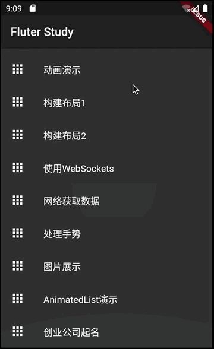

# 001-项目首页的设定

[返回首页](../readme.md)

##1. 文件名
	main.dart
##2. 创建一个列表
由于这是一个学习项目，会有很多的案例设计和实现，所以要在主页面中创建一个ListView Widget, 其中的每一项代表一个案例。定义一个列表描述每一项案例的名字。并通过这个列表生成ListView Widget.

	final _listViewItems = <String>[];
	///初始化ListView中每一项的内容显示
	_initListViewItems() {
	  _listViewItems.add(SharedPreferenceSampleRoute.sharedPreferenceSample);
	  _listViewItems.add(AnimationControllerSampleRoute.animationControllerSample);
	  _listViewItems.add(LayoutSample1Route.layoutSampleRoute);
	  _listViewItems.add(LayoutSample2Route.layoutSampleRoute);
	  _listViewItems.add(WebSocketSampleRoute.webSocketSampleRoute);
	  _listViewItems.add(NetworkSampleRoute.networkSampleRoute);
	  _listViewItems.add(GestureSampleRoute.gestureSampleRoute);
	  _listViewItems.add(ImagesSampleRoute.imagesSampleRoute);
	  _listViewItems.add(AnimatedListRoute.animatedListSample);
	  _listViewItems.add(StartupNameRoute.startupName);
	}
##3.创建一个路由列表
在ListView Widget中每一项都会监听一个点击事件，用户通过点击每一项就会跳转到相应的路由。创建一个路由列表，然后可以通过Navigator.pushNamed的方法实现跳转功能.

	final _routes = <String, WidgetBuilder>{};
	///建立路由列表
	///
	///为ListView中的每一项设置相应的路由，然后通过[Navigator.pushNamed]的跳转的相应路由
	_initRoutes() {
	  _routes[SharedPreferenceSampleRoute.sharedPreferenceSample] = (context) => SharedPreferenceSampleRoute();
	  _routes[AnimationControllerSampleRoute.animationControllerSample] = (context) => AnimationControllerSampleRoute();
	  _routes[LayoutSample1Route.layoutSampleRoute] = (context) => LayoutSample1Route();
	  _routes[LayoutSample2Route.layoutSampleRoute] = (context) => LayoutSample2Route();
	  _routes[WebSocketSampleRoute.webSocketSampleRoute] = (context) => WebSocketSampleRoute();
	  _routes[NetworkSampleRoute.networkSampleRoute] = (context) => NetworkSampleRoute();
	  _routes[GestureSampleRoute.gestureSampleRoute] = (context) => GestureSampleRoute();
	  _routes[ImagesSampleRoute.imagesSampleRoute] = (context) => ImagesSampleRoute();
	  _routes[AnimatedListRoute.animatedListSample] = (context) => AnimatedListRoute();
	  _routes[StartupNameRoute.startupName] = (context) => StartupNameRoute();
	}

##4. 根据列表创建ListView Widget
	///根据List构建一个ListView Widget,并设置点击回调方法
	Widget _bodyContent(BuildContext context) {
		return ListView.builder(
		  itemCount: items.length,
		  itemBuilder: (context, index) {
		    return ListTile(
		      leading: Icon(Icons.apps),
		      title: Text(items[index]),
		      onTap: () => _jumpDetailRoute(context, items[index]),
		    );
		  },
		);
	}

##5. 根据路由列表跳转到相应的路由
	///通过列表项中的名字查找在_routes中映射并跳转到相应的路由
	void _jumpDetailRoute(BuildContext context, String itemName){
		Navigator.pushNamed(context, itemName);
	}

##6. 构建主页面
	@override
	  Widget build(BuildContext context) {
	    return Scaffold(
	      appBar: AppBar(
	        title: Text(title),
	      ),
	      body: _bodyContent(context),
	    );
	  }
##7. 效果图
