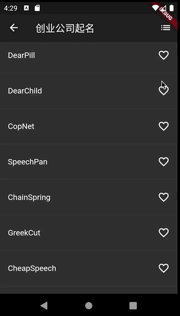

#002-创业公司起名

[返回首页](../readme.md)

##1. 文件名
	start_name.dart
##2. 功能描述
在这个页面中，使用第三方插件随机生成名字作为创业公司候选名字并展示在页面中，用户可以点击喜爱的名字进行收藏。

在工具栏提供一个列表按钮，点击列表按钮可以展示所有喜欢的创业公司候选名字。

##3.引入生成名字的插件库
###3.1 在`pubspec.yaml`中添加依赖:

	dependencies:
		english_words: ^3.1.5
###3.2 执行`flutter packages get`获取插件库
	flutter packages get
	Running "flutter pub get" in flutter_study...                      22.6s
	Process finished with exit code 0
###3.3 导入插件库
	import 'package:english_words/english_words.dart';

##4. 展示一个随机生成的公司名字列表
	///展示一个随机生成的公司名字的列表
	  Widget _buildContent() {
	    return ListView.builder(itemBuilder: (context, index) {
	      return _generateListRow(context, index);
	    });
	  }
	  
	///列表项直接用分割线分割，每次使用第三方插件生成10个名字，当到达列表底部后再产生10个新的名字
  	Widget _generateListRow(BuildContext context, int index) {
    if (index.isOdd) {
      return Divider();
    }

    ///由于中间有分割线，实际list的位置是index的一半
    final pos = index ~/ 2;

    if (pos >= _suggestions.length) {
      _suggestions.addAll(generateWordPairs().take(10));
    }

    return _buildRowWidget(_suggestions[pos]);
  	}

  	///每个列表项后面添加一个收藏图标并监听点击事件
  	///使用不同的图标和颜色标示是否收藏
 	 Widget _buildRowWidget(WordPair pair) {
    final selected = _saved.contains(pair);

    return ListTile(
      title: Text(pair.asPascalCase),
      trailing: Icon(
        selected ? Icons.favorite : Icons.favorite_border,
        color: selected ? Colors.red : null,
      ),
      onTap: () => _onTap(pair, selected),
    );
 	}
##5. appBar中添加一个列表按钮并监控点击事件
	@override
	  Widget build(BuildContext context) {
	    return Scaffold(
	      appBar: AppBar(
	        title: Text(StartupNameRoute.startupName),
	        ///appBar中添加一个列表按钮并监听点击事件
	        actions: <Widget>[
	          IconButton(
	            icon: Icon(Icons.list),
	            onPressed: () => _onFavoriteRoute(context),
	          ),
	        ],
	      ),
	      body: _buildContent(),
	    );
	  }
	  
	///点击appBar上的列表按钮，跳转到展示收藏喜欢名字页面
	  void _onFavoriteRoute(BuildContext context) {
	    Navigator.of(context).push(MaterialPageRoute(builder: (context) => _favoriteListRoute(context)));
	  }
##6.展示收藏的公司名字
	///显示收藏的名字
	  Widget _favoriteList() {
	    return ListView.builder(
	      itemCount: _saved.length,
	      itemBuilder: (context, index) {
	        return ListTile(
	          title: Text(_saved.elementAt(index).asPascalCase),
	        );
	      },
	    );
	  }
##7.效果图
