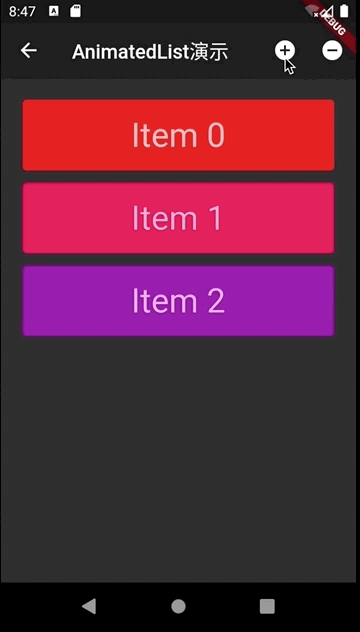

#003-AnimatedList演示

[返回首页](../readme.md)

##1. 文件名
	animatedlist_demo.dart

##2. 功能描述
在这个页面中，通过添加和删除列表项展示AnimatedList Widget的使用

##3.效果图

##4.设置添加和删除按钮
在appBar中设置添加和删除按钮并绑定相应的回调

	///在appBar中添加2个按钮，一个是添加按钮，另外一个删除按钮
	  ///点击添加按钮添加一列表项
	  ///选中一项并点击删除按钮，则删除选中项
	  @override
	  Widget build(BuildContext context) {
	    return Scaffold(
	      appBar: AppBar(
	        title: Text(AnimatedListRoute.animatedListDemo),
	        actions: <Widget>[
	          IconButton(
	            icon: Icon(Icons.add_circle),
	            onPressed: _insert,
	          ),
	          IconButton(
	            icon: Icon(Icons.remove_circle),
	            onPressed: _remove,
	          )
	        ],
	      ),
	      body: _buildBody(),
	    );
	  }
##5. 添加按钮回调

	///点击添加按钮插入一项，如果已经选中一项，就插入到选中项的前面，否则插到列表项的末尾，并执行插入动画
	  void _insert() {
	    final int index = _selectedItem == null ? _list.length : _list.indexOf(_selectedItem);
	    _list.insert(index, _nextItem++);
	    AnimatedListState _animatedList = _listKey.currentState;
	    _animatedList.insertItem(index);
	  }
##6. 删除按钮回调

	///删除选中项，并执行删除动画
	  void _remove() {
	    if (_selectedItem != null) {
	      int index = _list.indexOf(_selectedItem);
	      int item = _selectedItem;
	      AnimatedListState _animatedList = _listKey.currentState;
	      _animatedList.removeItem(index, (BuildContext context, Animation<double> animation){
	        return _buildItem(context, item, animation);
	      });
	      _list.removeAt(index);
	      setState(() {
	        _selectedItem = null;
	      });
	    }
	  }
##7. 构建列表项

	///构建AnimationList中的每一项，默认的animation是kAlwaysCompleteAnimation
	  Widget _buildItem(BuildContext context, int item, Animation<double> animation){
	    final selected = _selectedItem == item;
	    TextStyle textStyle = Theme.of(context).textTheme.display1;
	    if(selected) textStyle = textStyle.copyWith(color: Colors.lightBlueAccent[400]);
	
	    return Padding(
	      padding: EdgeInsets.all(2.0),
	      child: SizeTransition(
	        sizeFactor: animation,
	        child: GestureDetector(
	          onTap: () => _onItemTap(item),
	          child: SizedBox(
	            height: 80.0,
	            child: Card(
	              color: Colors.primaries[item % Colors.primaries.length],
	              child: Center(
	                child: Text('Item $item', style: textStyle,),
	              ),
	            ),
	          ),
	        ),
	      ),
	    );
	  }