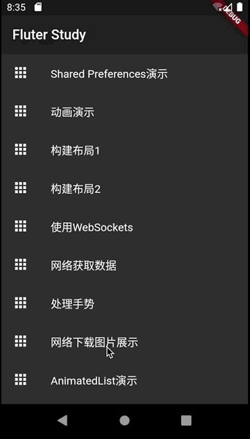

#004-网络加载图片演示

[返回首页](../readme.md)

##1. 文件名
	network_load_images_demo.dart

##2. 功能描述
在这个页面中，使用不同的方式从网络下载图片并展示的方式。

##3.效果图

##4.不同下载和展示方式
###4.1 加载静态和动态图片
加载静态和动态的图片的方式都是一样的，使用`Image.network`。但是这种方式对用户不友好，在图片还没有完整下载完时，页面上没有任何的展示，并且下载完后图片突然出现。

###4.2 使用占位符淡入图片
使用`FadeInImage.memoryNetwork`方式下载图片，在图片下载完成后使用淡入方式显示图片，并借助`Stack`构建一个正在加载图标.

	Stack(
      children: <Widget>[
        Center(child:CircularProgressIndicator()),
        Center(
          child: FadeInImage.memoryNetwork(
              placeholder: kTransparentImage,
              image: imageUrl),
        ),
###4.3 缓存占位符淡入图片
使用`CachedNetworkImage`方式下载图片，在这个Widget中可以指定占位符的方式，并且在图片下载完成后也使用淡入的方式显示图片.

	CachedNetworkImage(
      placeholder: (context, url) => CircularProgressIndicator(),
      imageUrl: imageUrl,
    );