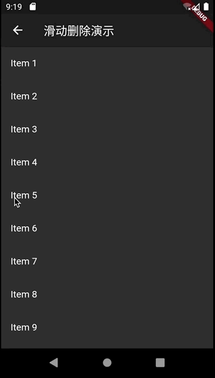

#005-Dismissible演示

[返回首页](../readme.md)

##1. 文件名
	dismissible_demo.dart

##2. 功能描述
在这个页面中，展示`Dismissible`Widget的使用方式。
通过滑动方式删除所选项。

	const Dismissible({
	    @required Key key,//
	    @required this.child,//
	    this.background,//滑动时组件下一层显示的内容，没有设置secondaryBackground时，从右往左或者从左往右滑动都显示该内容，设置了secondaryBackground后，从左往右滑动显示该内容，从右往左滑动显示secondaryBackground的内容
	    //secondaryBackground不能单独设置，只能在已经设置了background后才能设置，从右往左滑动时显示
	    this.secondaryBackground,//
	    this.onResize,//组件大小改变时回调
	    this.onDismissed,//组件消失后回调
	    this.direction = DismissDirection.horizontal,//
	    this.resizeDuration = const Duration(milliseconds: 300),//组件大小改变的时长
	    this.dismissThresholds = const <DismissDirection, double>{},//
	    this.movementDuration = const Duration(milliseconds: 200),//组件消失的时长
	    this.crossAxisEndOffset = 0.0,//
	    })

##3.效果图

##4.产生20个列表项
	final items = List<String>.generate(20, (i) => "Item ${i + 1}");

##5.显示列表项
	Widget build(BuildContext context) {
	    return ListView.builder(
	      itemCount: widget.items.length,
	      itemBuilder: _buildRow,
	    );
	  }
##6.构建列表每一项
列表每一项使用`Dismissible`包括`ListTile`,并设置`onDismissed`监听事件。

	Widget _buildRow(BuildContext context, int index) {
	    final item = widget.items[index];
	    return Dismissible(
	      key: Key(item),
	      child: ListTile(title: Text('$item')),
	      background: Container(color: Colors.red),
	      secondaryBackground: Container(color: Colors.lightBlue,),
	      onDismissed: (direction) => _onDismiss(context, direction, index),
	    );
	  }
##7.回调函数的实现
在回调函数中从列表项中删除所选项，并更新界面.

	void _onDismiss(BuildContext context, DismissDirection direction, int index) {
	    setState(() {
	      widget.items.removeAt(index);
	    });
	  }