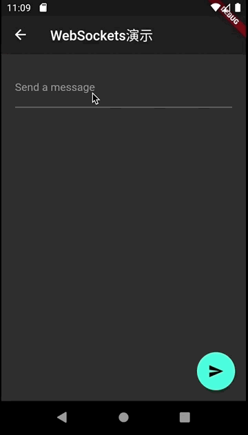

#006-websocket演示
[返回首页](../readme.md)

##1. 文件名
	websocket_sample.dart

##2. 功能描述
在这个页面中，主要展示的是如何使用`WebSocketChannel`和websocket服务器进行双向通信。在这个演示中开始向服务器发送一段消息，然后服务器会把发送的消息再返回给请求方，并回显出来。

##3.效果图

##4.具体实现
###4.1 定义一个WebSocketChannel并连接上服务器

  	final WebSocketChannel channel = IOWebSocketChannel.connect("ws://echo.websocket.org");
 
###4.2 接收用户输入消息
使用`Form`和`TextFormField`控件接收用户输入的消息。

  	TextEditingController _controller = TextEditingController();

	Form(
	    child: TextFormField(
	      controller: _controller,
	      decoration: InputDecoration(labelText: 'Send a message'),///提示信息
	    ),
	  ),

###4.3 发送消息
点击`floatingActionButton`发送按钮， 当`TextFormField`中用户输入的内容不为空时，通过`WebSocketChannel`发送到服务器上。

	void _sendMessage() {
	    if (_controller.text.isNotEmpty) {
	      widget.channel.sink.add(_controller.text);
	    }
  	}
###4.4 接收消息
使用`StreamBuilder`接收从服务器回复的消息并展示出来。

	StreamBuilder(
	    stream: widget.channel.stream,
	    builder: (context, snapshot) {
	      return Padding(
	        padding: const EdgeInsets.symmetric(vertical: 24.0),
	        child: Text(snapshot.hasData ? '${snapshot.data}' : ''),
	      );
	    },
	  ),
###4.5 断开服务器连接
当页面销毁时断开服务器连接，避免内存泄露.

	@override
	  void dispose() {
	    widget.channel.sink.close();
	    super.dispose();
	  }