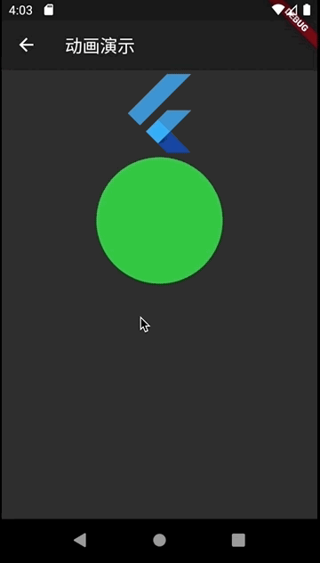

#008-动画演示
[返回首页](../readme.md)

##1. 文件名
	animation_demo.dart

##2. 功能描述
在这个页面中，主要展示的是使用Flutter的几种方式创建动画效果。在这里只是简要说明一下几种动画方式的展示，至于动画原理和具体实现原理，请参阅官方文档。

##3.效果图

##4.具体实现
`Animation`是生成动画过程中的值。该值可以是double 类型或者Size/Color类型等。 `AnimationController`是动画实现的核心控制器，它是一种特殊的`Animation`,它主要控制动画的时间以及动画的动作状态。`Tween`差值器，在`AnimationController`中设定的时间内均匀生成begin 和 end 的值。通过 animation.value来获取。`Curve`补值器，通过各种函数来实现动画过程的非线性操作。

在此基础上，Flutter还为我们提供了自带动画属性的Widget,方便我们使用简单的动画，只要自定义Widget并集成于AnimatedWidget，从外部传入一个Animation对象。

还有一种创建动画的方式是使用AnimatedBuilder,这是一种把动画和Widget实现的分离的方式。

###4.1 使用Animation + AnimationController的方式
4.1.1定义`AnimationController`. 

	AnimationController controller = AnimationController(duration: Duration(milliseconds: 2000), vsync: this);
	
4.1.2定义`Animation`,并于Controller绑定。

	Animation<int> _tween = IntTween(begin: 0, end: 50).animate(curve);
	
4.1.3绑定监听器，并调用setState刷新页面。

	_tween.addListener(() => this.setState(() {}));

4.1.4在Widget中使用Animiation产生的值

		_tween.value
	
4.1.5通过控制器控制动画的运动

	controller.forward(); //or controller.reverse();

###4.2 使用AnimatedWidget的方式

	MyAnimatedWidget(
          animation: _colorTween,
        ),
        
	class MyAnimatedWidget extends AnimatedWidget {
	  MyAnimatedWidget({Key key, Animation<Color> animation}) : super(key: key, listenable: animation);
	
	  @override
	  Widget build(BuildContext context) {
	    final Animation<Color> animation = listenable;
	    return AspectRatio(
	      aspectRatio: 2.5,
	      child: Container(
	        margin: EdgeInsets.symmetric(horizontal: 80),
	        decoration: BoxDecoration(
	          shape: BoxShape.circle,
	          color: animation.value,
	        ),
	      ),
	    );
	  }
	}

###4.3 使用AnimatedBuild的方式

	AnimatedBuilder(
      animation: _tween,
      child: Container(
        decoration: BoxDecoration(color: Colors.redAccent),
      ),
      builder: (context, child) {
        return Container(
          width: _tween.value * 1.0,
          height: _tween.value * 1.0,
          child: child,
        );
      },
    ),