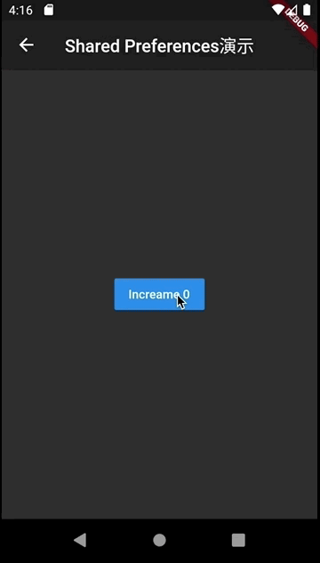

#009-SharedPreference演示
[返回首页](../readme.md)

##1. 文件名
	shared_preference_demo.dart

##2. 功能描述
在这个页面中，展示如何使用SharedPreference的方式来存储和读取数据。为简单数据提供一种永久存取的方式。

##3.效果图

##4.具体实现
通过`SharedPreferences.getInstance`的方式获取SharedPreference的单例。注意这个方法是一种异步操作，要在调用的地方使用await

	SharedPreferences prefs = await SharedPreferences.getInstance();
	
通过`SharedPreference.getXXX`的方式获取存储的值，通过`SharedPreference.setXXX`的方式存储新的值。

	nCount = (prefs.getInt('counter') ?? 0) + 1;
    prefs.setInt('counter', nCount);

##5.代码样例
在这个样例中，通过点击按钮从SharedPreference中读取数据显示在按钮中，并把读取的值加1并存回到SharedPreference文件中。

	class SharedPreferenceSampleRoute extends StatefulWidget {
	  static final String sharedPreferenceSample = 'Shared Preferences演示';
	
	  @override
	  State<StatefulWidget> createState() => _SharedPreferenceSampleState();
	}
	
	class _SharedPreferenceSampleState extends State<SharedPreferenceSampleRoute>{
	  int nCount = 0;
	  @override
	  Widget build(BuildContext context) {
	    return Scaffold(
	      appBar:  AppBar(
	        title: Text(SharedPreferenceSampleRoute.sharedPreferenceSample),
	      ),
	      body: _buildContent(),
	    );
	  }
	
	  Widget _buildContent() {
	    return Center(
	      child: RaisedButton(
	        child: Text('Increame $nCount'),
	        onPressed: _incrementCount,
	      ),
	    );
	  }
	
	
	  void _incrementCount() async{
	
	    SharedPreferences prefs = await SharedPreferences.getInstance();
	    nCount = (prefs.getInt('counter') ?? 0) + 1;
	    prefs.setInt('counter', nCount);
	
	    setState(()  {});
	  }
	}